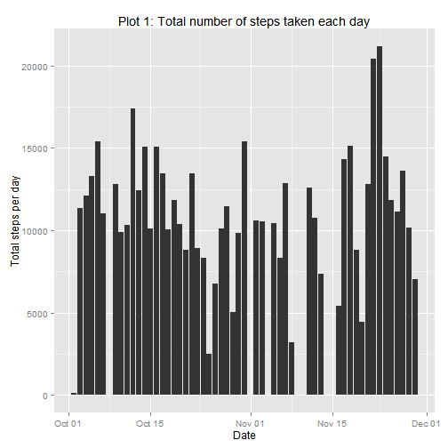
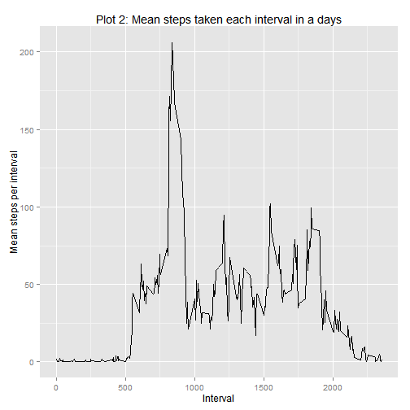
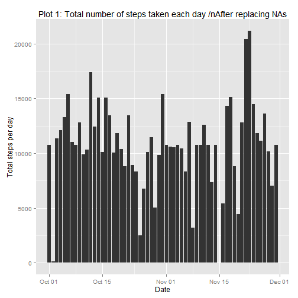
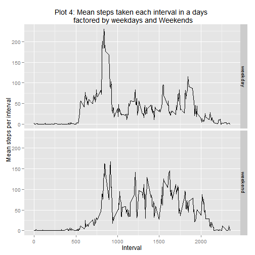

# Reproducible Research: Peer Assessment 1
### Load required packages and set global parameters

```r
packages <- c("data.table", "ggplot2")
sapply(packages, require, character.only=TRUE, quietly=TRUE)
```

```
## data.table 1.9.2  For help type: help("data.table")
```

```
## data.table    ggplot2 
##       TRUE       TRUE
```

```r
knitr::opts_chunk$set(fig.path='figures/')
```


### Loading and preprocessing the data

```r
path <- getwd()
url <- "https://d396qusza40orc.cloudfront.net/repdata%2Fdata%2Factivity.zip"
f <- "activity.zip"

if (!file.exists("activity.zip")) {
        download.file(url,file.path(path,f))
        
         
}
if (!file.exists("activity.csv")) {
        unzip(file.path(path,f),exdir=getwd())
}
activityData <- read.csv(file = "activity.csv", stringsAsFactors = FALSE)

head(activityData)
```

```
##   steps       date interval
## 1    NA 2012-10-01        0
## 2    NA 2012-10-01        5
## 3    NA 2012-10-01       10
## 4    NA 2012-10-01       15
## 5    NA 2012-10-01       20
## 6    NA 2012-10-01       25
```

```r
summary(activityData)
```

```
##      steps           date              interval   
##  Min.   :  0.0   Length:17568       Min.   :   0  
##  1st Qu.:  0.0   Class :character   1st Qu.: 589  
##  Median :  0.0   Mode  :character   Median :1178  
##  Mean   : 37.4                      Mean   :1178  
##  3rd Qu.: 12.0                      3rd Qu.:1766  
##  Max.   :806.0                      Max.   :2355  
##  NA's   :2304
```

Looks like date is of class Character. Change it to Date


```r
activityData$date <- as.Date(activityData$date)
```

#### What is mean total number of steps taken per day?
#### 1. Make a histogram of the total number of steps taken each day
Let us aggregate data first to create histogram


```r
stepsPerDay <- aggregate(steps ~ date, data=activityData, FUN=sum, na.rm=TRUE)
# Let us see if data is generated
head(stepsPerDay)
```

```
##         date steps
## 1 2012-10-02   126
## 2 2012-10-03 11352
## 3 2012-10-04 12116
## 4 2012-10-05 13294
## 5 2012-10-06 15420
## 6 2012-10-07 11015
```
with data being aggregated let us create histogram. Following plot - plot 1 is created using ggplot showing histogram of total number of steps taken each day


```r
qplot(date, steps,
              data=subset(activityData, complete.cases(activityData)),
              stat='summary', fun.y=sum, geom='bar') +
        labs(title='Plot 1: Total number of steps taken each day',
             y='Total steps per day', x='Date')
```

 

#### 2. Calculate and report the **mean** and **median** total number of steps taken per day

```r
mean(na.omit(stepsPerDay$steps))
```

```
## [1] 10766
```

```r
median(na.omit(stepsPerDay$steps))
```

```
## [1] 10765
```


### What is the average daily activity pattern?
#### 1.Make a time series plot (i.e. type = "l") of the 5-minute interval (x-axis) and the average number of steps taken, averaged across all days (y-axis)
This can be done by aggregating steps for each interval and ploting line graph as shown in Plot 2 below

```r
dsi <- aggregate(steps ~ interval, activityData, mean)

qplot(x=interval, y=steps,
      data=dsi, geom='line') +
        labs(title='Plot 2: Mean steps taken each interval in a days',
             y='Mean steps per interval', x='Interval')
```

 

#### 2. Which 5-minute interval, on average across all the days in the dataset, contains the maximum number of steps?


```r
dsi[dsi$steps==max(dsi$steps),]$interval
```

```
## [1] 835
```

### Imputing missing values
#### 1. Calculate and report the total number of missing values in the dataset (i.e. the total number of rows with `NA`s)

```r
# Count the number of NAs accross the Dataset

totalNA <- sum(is.na(activityData))
```

```r
# Total missing steps
stepNA <- sum(is.na(activityData$steps))

# Total Missing Dates
dateNA <- sum(is.na(activityData$date))
```
There are total 2304 missing data accross dataset. There are 2304 missing steps and 0 missing dates.

#### 2. Devise a strategy for filling in all of the missing values in the dataset.

The strategy does not need to be sophisticated. For example, you could use the mean/median for that day, or the mean for that 5-minute interval, etc.

Let us use use the means for the 5-minute intervals as fillers for missing values and create new dataset and round it to integer


#### 3. Create a new dataset that is equal to the original dataset but with the missing data filled in.


```r
activityData_mod <- merge(activityData, dsi, by="interval", suffixes=c("",".new"))
nas <- is.na(activityData_mod$steps)
activityData_mod$steps[nas] <- activityData_mod$steps.new[nas]
activityData <- activityData_mod[,c(1:3)]
```


#### 4. Make a histogram of the total number of steps taken each day and Calculate and report the mean and median total number of steps taken per day. 

```r
qplot(date, steps,
              data=subset(activityData, complete.cases(activityData)),
              stat='summary', fun.y=sum, geom='bar') +
        labs(title='Plot 1: Total number of steps taken each day /nAfter replacing NAs',
             y='Total steps per day', x='Date')
```

 

```r
mean(activityData$steps)
```

```
## [1] 37.38
```

```r
median(activityData$steps)
```

```
## [1] 0
```


#### Are there differences in activity patterns between weekdays and weekends?
For this part the weekdays() function may be of some help here. Use the dataset with the filled-in missing values for this part.

####1. Create a new factor variable in the dataset with two levels - "weekday" and "weekend" indicating whether a given date is a weekday or weekend day.

I wanted to avoid for loop and did some reasearch on better way to cataogarize weekdays. %u format actually returns value from 1 to 7 for day in a week. 6 and 7 being weekends. Let us add one column with values weekday or weekend


```r
activityData$dayOfWeek <- factor(ifelse(as.integer(format(activityData$date, format = '%u')) %in% c(1:5),
         'weekday', 'weekend'))
```
####2. Make a panel plot containing a time series plot (i.e. type = "l") of the 5-minute interval (x-axis) and the average number of steps taken, averaged across all weekday days or weekend days (y-axis). The plot should look something like the following, which was creating using simulated data:


```r
qplot(x=interval, y=steps,
      data=dsim, geom='line') + facet_grid(dayOfWeek~.) +
        labs(title='Plot 4: Mean steps taken each interval in a days \n factored by weekdays and Weekends',
             y='Mean steps per interval', x='Interval')
```

 


